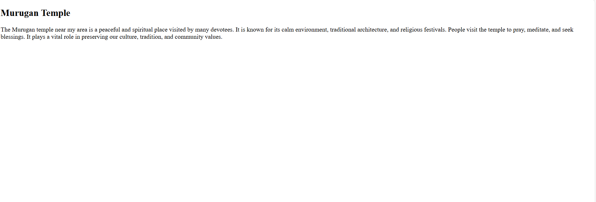
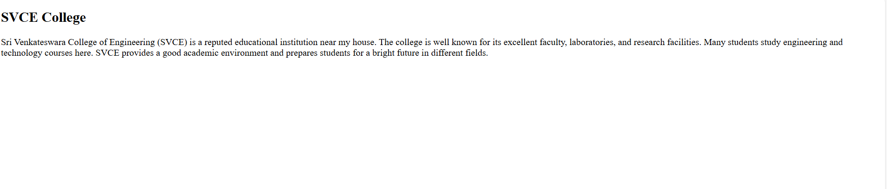
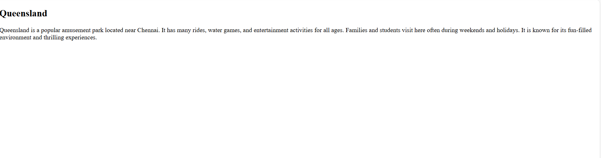

# Ex04 Places Around Me
## Date: 22.09.2025

## AIM
To develop a website to display details about the places around my house.

## DESIGN STEPS

### STEP 1
Create a Django admin interface.

### STEP 2
Download your city map from Google.

### STEP 3
Using ```<map>``` tag name the map.

### STEP 4
Create clickable regions in the image using ```<area>``` tag.

### STEP 5
Write HTML programs for all the regions identified.

### STEP 6
Execute the programs and publish them.

## CODE
```
home.html
<!-- Image Map Generated by http://www.image-map.net/ -->


<map name="image-map">
    <area target="_blank" alt="Queensland" title="Queensland" href="queensland.html" coords="792,295,117" shape="circle">
    <area target="_blank" alt="Temple" title="Temple" href="temple.html" coords="1276,642,110" shape="circle">
    <area target="_blank" alt="Svce" title="Svce" href="svce.html" coords="357,659,100" shape="circle">
</map>

quennsland.html
<!DOCTYPE html>
<html>
<head>
  <title>Queensland</title>
</head>
<body>
  <h2>Queensland</h2>
  <p>
    Queensland is a popular amusement park located near Chennai. 
    It has many rides, water games, and entertainment activities for all ages. 
    Families and students visit here often during weekends and holidays. 
    It is known for its fun-filled environment and thrilling experiences.
  </p>
</body>
</html>

svce.html
<!DOCTYPE html>
<html>
<head>
  <title>SVCE College</title>
</head>
<body>
  <h2>SVCE College</h2>
  <p>
    Sri Venkateswara College of Engineering (SVCE) is a reputed educational institution near my house. 
    The college is well known for its excellent faculty, laboratories, and research facilities. 
    Many students study engineering and technology courses here. 
    SVCE provides a good academic environment and prepares students for a bright future in different fields.
  </p>
</body>
</html>

temple.html
<!DOCTYPE html>
<html>
<head>
  <title>Murugan Temple</title>
</head>
<body>
  <h2>Murugan Temple</h2>
  <p>
    The Murugan temple near my area is a peaceful and spiritual place visited by many devotees. 
    It is known for its calm environment, traditional architecture, and religious festivals. 
    People visit the temple to pray, meditate, and seek blessings. 
    It plays a vital role in preserving our culture, tradition, and community values.
  </p>
</body>
</html>
```

## OUTPUT





## RESULT
The program for implementing image maps using HTML is executed successfully.
